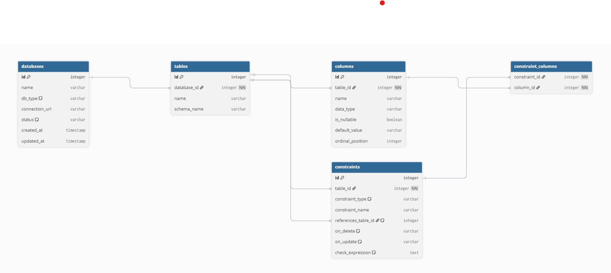

# TableTrail

A self-hosted database schema explorer for developers onboarding into unfamiliar codebases.

Connect to your local database (PostgreSQL, MySQL, or MariaDB) running in Docker, and TableTrail scans the full structure — tables, columns, primary keys, foreign keys, and constraints — then visualizes it as an interactive, zoomable ER diagram.

Everything runs locally inside your own Docker network. No cloud, no external services, no data ever leaves your machine.

## Status

Work in progress — MVP under active development.

## Stack

- **Backend:** Python, FastAPI, SQLAlchemy
- **Database:** PostgreSQL (persistent schema cache)
- **Infrastructure:** Docker Compose

## DB-Architecture



## Getting Started

```bash
git clone https://github.com/<your-username>/tabletrail.git
cd tabletrail
cp .env.example .env
docker-compose up
```

## License

MIT